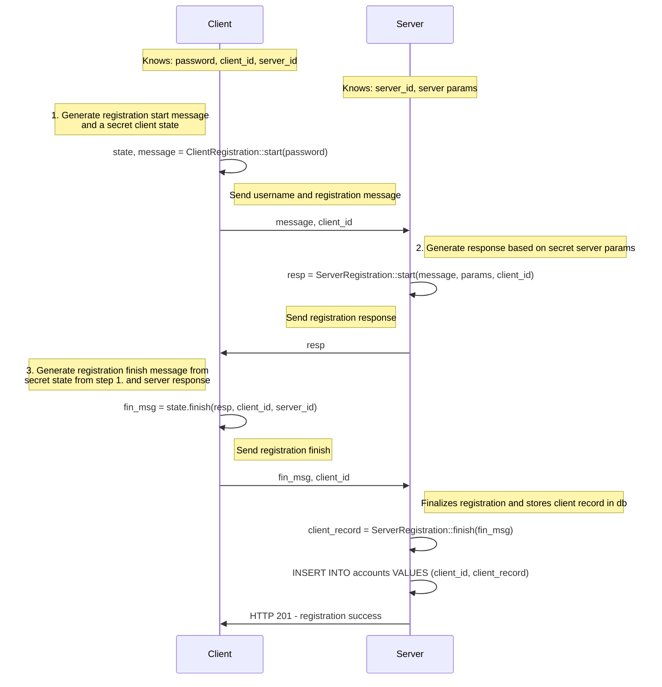
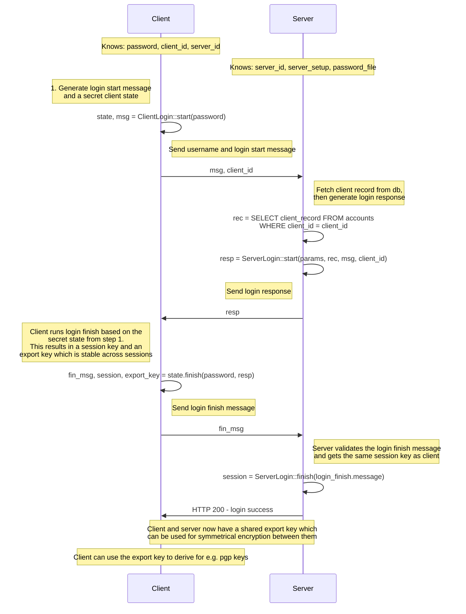

# Salauskilke

This is an experimental project into using cryptography and rust. The goal is to build an end-to-end encrypted application using OPAQUE for client-server key exchange.

## Overview of the opaque protocol

OPAQUE (Oblivious Pseudo-Random Function (OPRF) Augmented Password Authenticated Key Exchange) is a protocol designed to securely authenticate users based on their passwords without exposing the passwords to the server. It consists of two main stages: registration and authenticated key exchange (AKE).

Registration Phase:

    Client Initiation: The client, knowing its password, initiates the registration by generating a registration start message and a secret client state.

    Server Response: The server, possessing its private parameters, processes the client's message and generates a registration response.

    Client Finalization: Using the server's response and its secret state, the client creates a registration finish message and sends it to the server.

    Server Storage: The server finalizes the registration by storing the client's record in its database.

Login Phase:

    Client Initiation: The client starts the login process by generating a login start message and a secret client state using its password.

    Server Response: The server retrieves the client's record from its database and generates a login response based on this record and the client's message.

    Client Finalization: The client processes the server's response using its secret state, resulting in a session key and an export key. It then sends a login finish message to the server.

    Server Verification: The server verifies the client's finish message and derives the same session key.

Both the client and server now share a session key, enabling secure communication. Additionally, the export key can be used by the client for application-specific purposes, such as encrypting additional data.
CFRG

This protocol ensures that the client's password is never exposed to the server, enhancing security against potential breaches.
